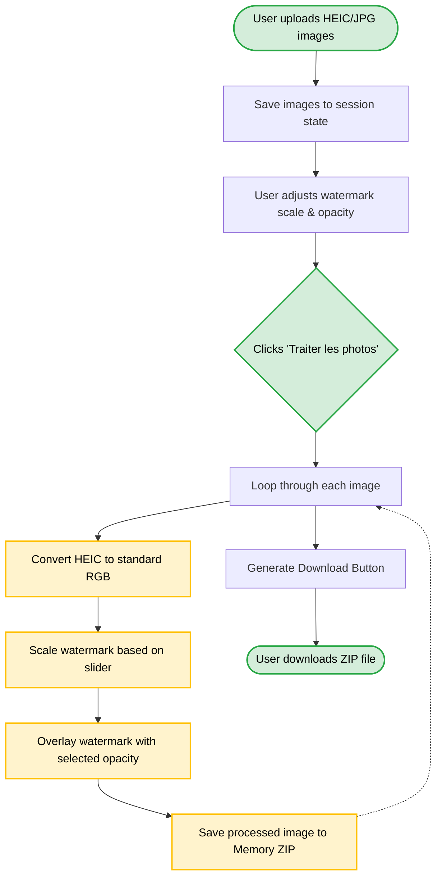
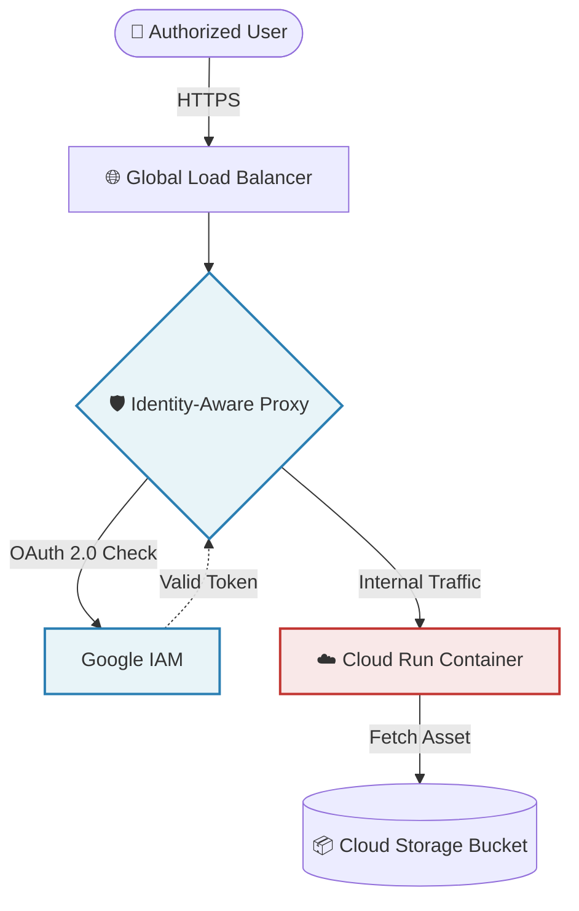
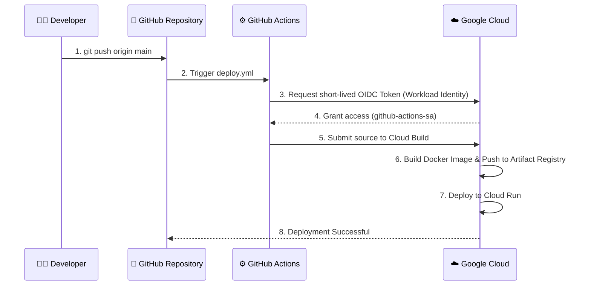

# Watermark Streamlit App

A production-grade, secure, and automated Streamlit application for batch-watermarking real estate photos. Built for performance, security, and ease of use.

## Features
- **Batch Processing**: Upload multiple high-resolution images simultaneously.
- **HEIC Support**: Natively processes Apple HEIC formats using `pillow-heif`.
- **Memory Optimized**: Uses Streamlit's `session_state` to prevent redundant processing loops.
- **Cloud Storage**: Fetches the official watermark asset directly from Google Cloud Storage.

## Application Workflow

Here is how the Streamlit application processes your images behind the scenes:



## Infrastructure Architecture

The application is deployed on Google Cloud Platform (GCP) with a Zero-Trust security model. The Cloud Run service is completely sealed from the public internet and can only be accessed through the Global Load Balancer and Identity-Aware Proxy (IAP).



## CI/CD Pipeline (GitHub Actions)

Deployments are 100% automated. When code is pushed to the `main` branch, GitHub Actions uses Workload Identity Federation (OIDC) to securely authenticate with Google Cloud without requiring static service account keys.



## Local Development

This project uses [Astral `uv`](https://github.com/astral-sh/uv) for lightning-fast Python dependency management.

### Setup
1. Clone the repository.
2. Ensure you are authenticated with Google Cloud locally so the app can fetch the watermark:
   ```bash
   gcloud auth application-default login
   ```
3. Run the application (`uv` will automatically resolve and install dependencies in milliseconds):
   ```bash
   uv run streamlit run app.py
   ```
